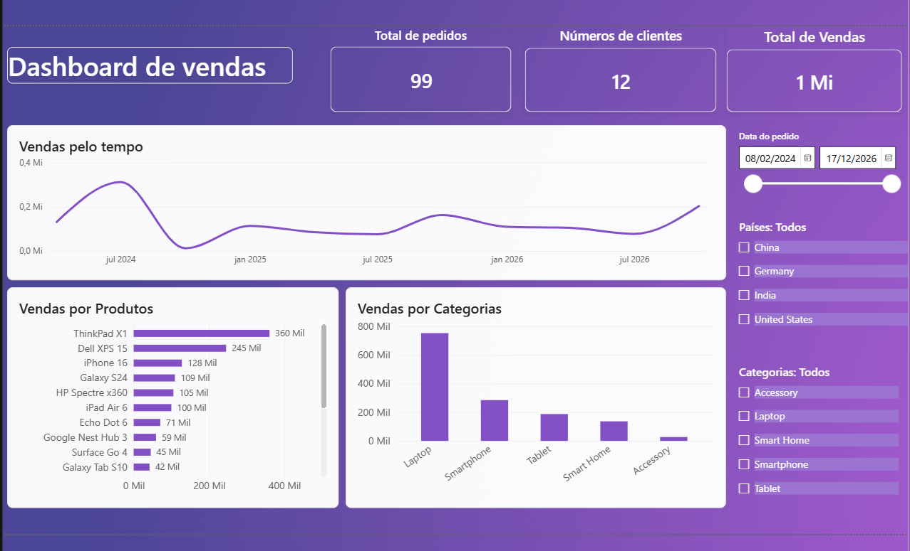

# Sales Dashboard - Power BI

## Objetivo

Dashboard interativo para análise de vendas, clientes e produtos.

## Ferramentas

- Power BI
- DAX
- Power Query

## Métricas

- Total de Vendas
- Total de Pedidos
- Total de Clientes

## Dashboard

## Principais Insights

- Categoria Laptop lidera as vendas.
- ThinkPad X1 é o produto mais vendido.
- As vendas variam significativamente ao longo do período.
